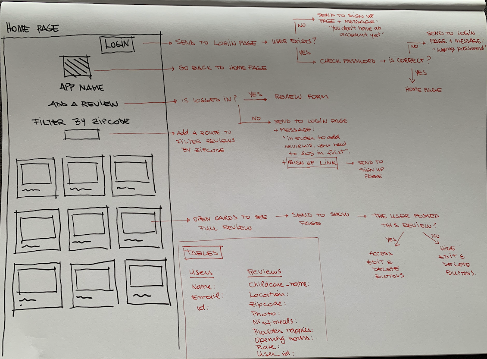

# nAPPies - CRUD APP

## About

This is an app with childcare reviews where parents can share their experiences to help other parents making better choices. On the home page you have access to all the reviews parents wrote about childcares and search reviews by zipcode. To be able to see a full review, you should click on the childcare card, then you'll be sent to a page with a full review about the childcare. If you want to write a review yourself, you'll need to be logged in. Once you login (or signup in case you don't have an account yet) you'll be able to write your own review. If you want to access only the reviews you wrote, you can click on the button "my reviews", next to your name on the nav bar. You can also delete and edit your reviews. And before leaving the app, you should click on the button "logout" on the nav bar..

### [click here]() to see my live project!

## Planning & Problem Solving

### Wireframe
    

This is my wireframe with the flow of the app. This helped me a lot! When I finished my wireframe I felt like my project was done! It is a very important tool to feel confident with what it needs to be done on your project and saves a lot of time! You just have to do it step by step. Wireframe an Trello board were my best friends during this project.

### [click here](https://trello.com/b/T1ByvzaV/crud-childcare-reviews-app) to see my Trello board!

## Technology used
- html
- css
- Javascript 
- Node
- Express
- Postgres

## Lessons learnt

Always believe in the power of a good wireframe and to do list!

## Bugs to be fixed

There is a bug on signup form. If you click on the signup button without typing anything on the input fields, a user is create with empty data. I have to create a condition checking if the values of the user input are not empty strings or null. 

## Future features 

- Add more filters maybe searching by location or name of the childcare
- Add comments on the show page where users can interact with each other and ask questions
- Choose a better font
- Make the app responsive
